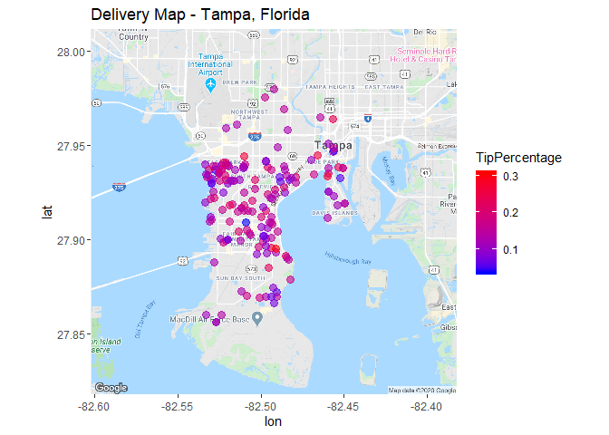
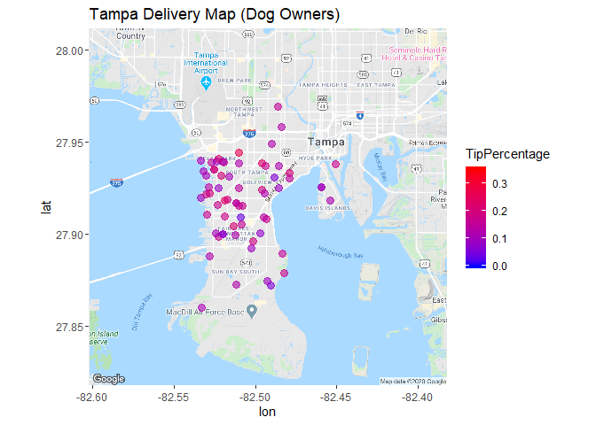
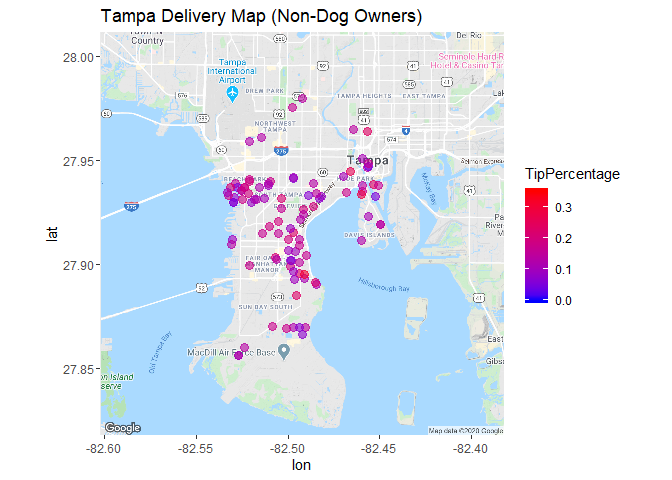
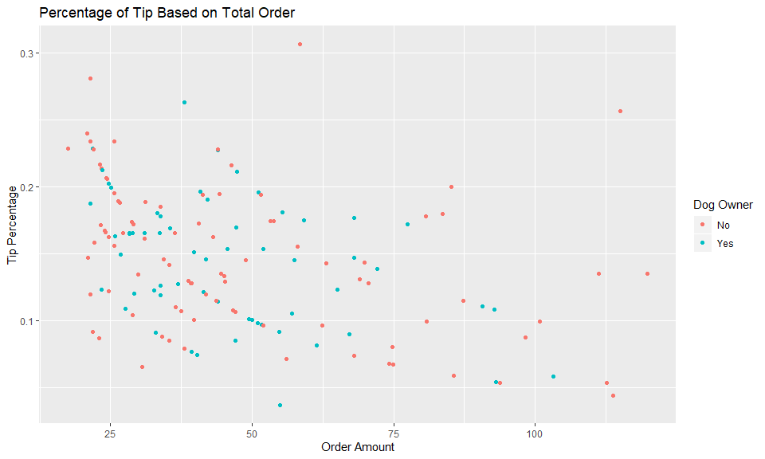
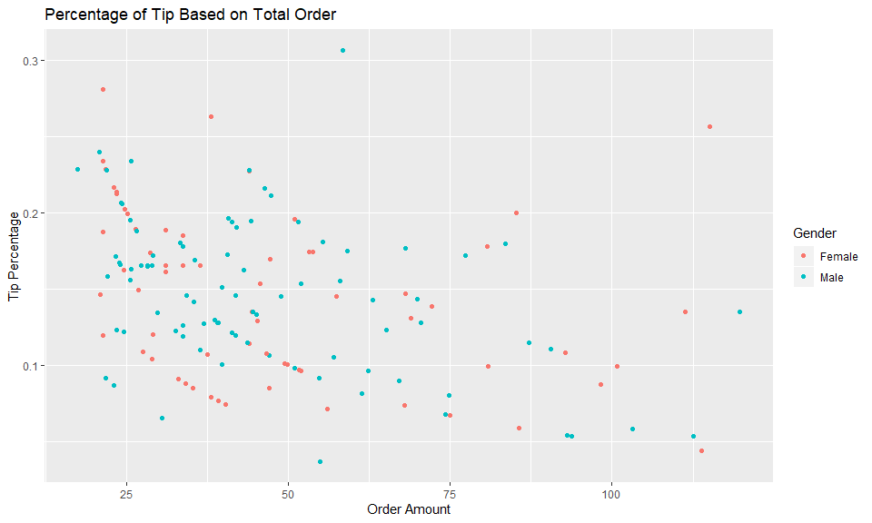
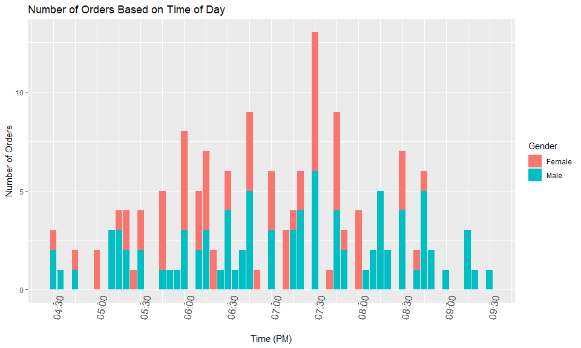
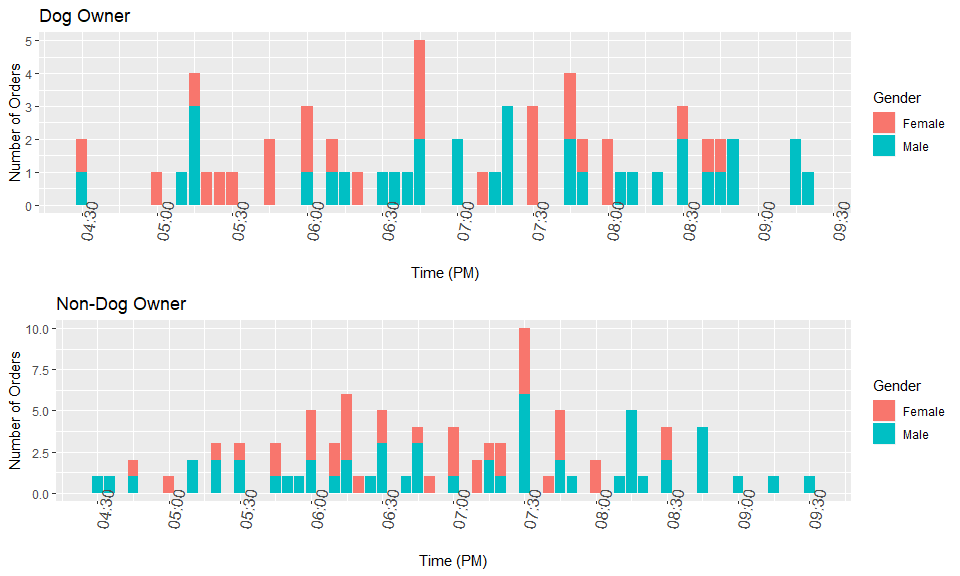
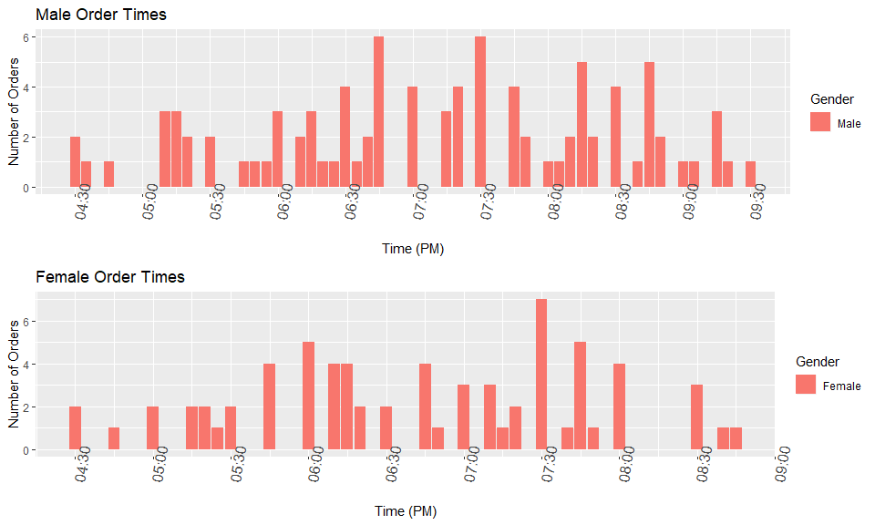
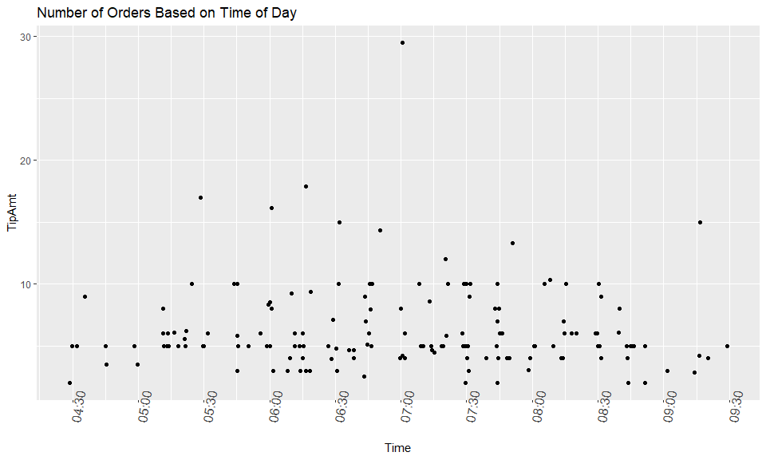
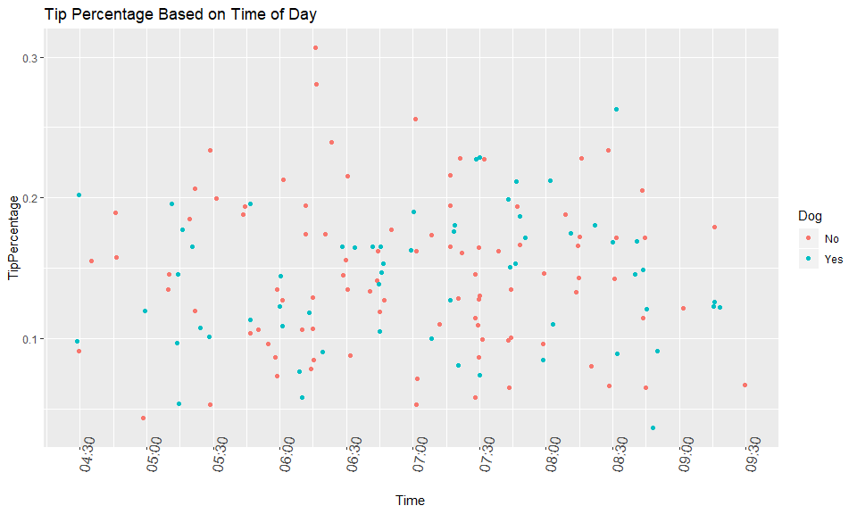

Delivery Driver Customer Analysis
================

Delivery Customer Data of 167 Observations with Data Taken on the Following Variables:

Date | Address | Order Amount | Tip Amount | Age | Time | Tip Included | Dog Owner

=======================================================

Delivery Map of Tampa, Florida Based on Tip Percentage of Total Order (Tip Percentage)

Average Tip Percentage of Dog Owners is 0.1396

 Average Tip Percentage of Non-Dog Owners is 0.1439.

Scatterplot of Tip Percentage of Total Order by Dog Owner

Scatterplot by Gender

Average Tip Percentage of Males is 0.1429

Average Tip Percentage of Females is 0.1412

Time Sequence Bar Chart of Orders Placed by Gender

Time Sequence Plots by Dog Owner vs. No Dog Owner

Time Sequence Dot Plot of Orders Placed and Tip Amount ($)

Time Sequence Dot Plot of Orders Placed

